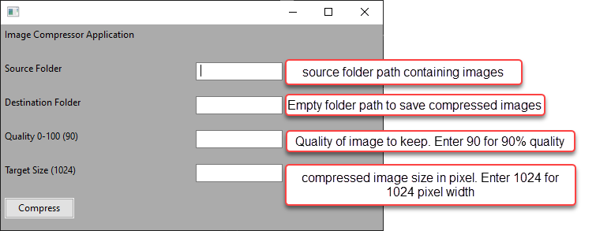

# Image Compressor Application

Python based app to bulk compress the raw full size image into specified quality and dimensions required, keeping the aspect ration intact.

## Steps to setup python environment 
1. Download all files on your local machine in some folder. (f.ex. C:\Temp\img-compressor-app)
2. Open Anaconda prompt and cd into this folder. `cd C:\Temp\img-compressor-app`
3. Setup Anaconda environment: `conda create --name compressor-app-env python=3.7 wxPython pyinstaller Pillow -y`
4. Activate new environment: `conda activate compressor-app-env`

### Run application using script
5. Run application: `python app.py`

### Building an Executable file
6. Build .EXE file: `pyinstaller app.py --onefile`
7. You can find EXE file under dist folder.

## App UI 

